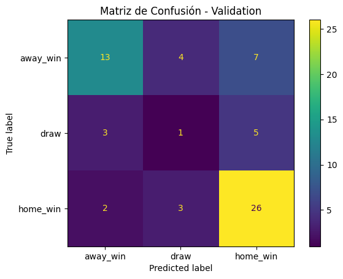
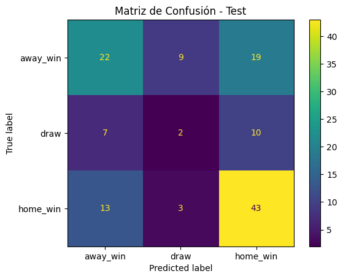
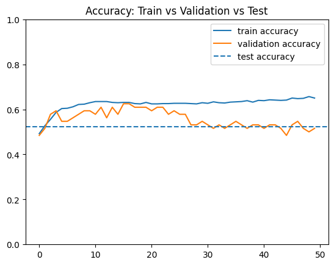
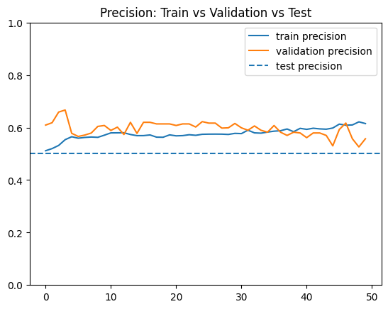
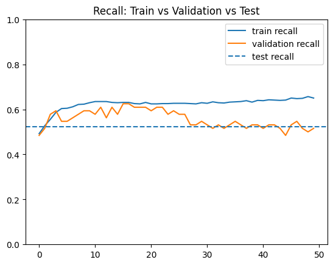
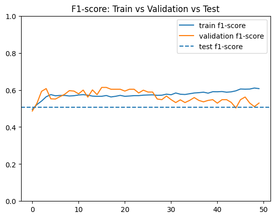

# WorldCupPredictor 

Proyecto de Machine Learning enfocado en la predicción de resultados de partidos de la Copa Mundial de la FIFA utilizando estadísticas históricas y features generadas a partir del desempeño acumulado de las selecciones.

---

# Objetivo del Proyecto

El objetivo principal de este proyecto es desarrollar un modelo de Machine Learning capaz de predecir el resultado de partidos de la Copa Mundial utilizando información histórica y desempeño previo de las selecciones.

El modelo busca identificar patrones históricos dentro de los Mundiales para intentar estimar si un equipo ganará, empatará o perderá un partido.

---

# Cambio de enfoque del proyecto

Inicialmente consideré utilizar datasets de fútbol internacional que incluían amistosos, eliminatorias y distintos torneos alrededor del mundo. La idea era utilizar una mayor cantidad de partidos para entrenar el modelo.

Sin embargo, después de analizar mejor el problema y el alcance real del proyecto, me di cuenta de que utilizar partidos internacionales generales añadía mucho ruido al modelo y no necesariamente aportaba valor para predecir encuentros mundialistas.

Esto se debe a varios factores:

- Los equipos que juegan Mundiales cambian dependiendo de la edición.
- Los amistosos y eliminatorias tienen contextos competitivos muy distintos.
- Un partido amistoso no representa la presión ni comportamiento de un partido de Copa Mundial.
- Algunos equipos juegan muchísimos partidos internacionales pero rara vez participan en Mundiales.

Debido a esto, decidí utilizar exclusivamente un dataset enfocado en partidos de la Copa Mundial de la FIFA, priorizando la relevancia del contexto competitivo sobre la cantidad total de datos.

Esta decisión me permitió construir un dataset más coherente con el objetivo real del proyecto.

---

# Dataset Utilizado

Dataset principal utilizado:

- [FIFA Football World Cup](https://www.kaggle.com/datasets/piterfm/fifa-football-world-cup)

Dataset internacional considerado inicialmente:

- [International Football Results From 1872 to 2026](https://www.kaggle.com/datasets/martj42/international-football-results-from-1872-to-2017)

---

# Limpieza y Preparación de Datos

El notebook encargado de la limpieza y generación de features se encuentra en:

```text
notebooks/preprocessingData/cleanData_newFeatures.ipynb
```

Durante el proceso de limpieza realicé las siguientes tareas:

- Limpieza y normalización de nombres de columnas.
- Conversión de fechas a formato datetime.
- Eliminación de espacios innecesarios.
- Ordenamiento cronológico de partidos.
- Creación de variables auxiliares.
- Creación de la variable objetivo del modelo.

Resultados obtenidos después de la limpieza:

```text
Dataset limpio: (964, 38)
```

---

# Variables Agregadas

Además de las columnas originales, agregué nuevas variables para aportar más contexto al modelo.

## Variables básicas

| Columna | Descripción |
|---|---|
| goal_difference | Diferencia de goles |
| total_goals | Total de goles en el partido |
| result_label | Resultado codificado |
| result_name | Resultado textual |
| world_cup_year | Año del Mundial |

---

# Feature Engineering

Una de las partes más importantes del proyecto fue la generación de features históricas para cada selección.

La idea fue que el modelo no solamente viera nombres de países, sino también estadísticas acumuladas y rendimiento previo antes de cada partido.

Todas las features fueron calculadas utilizando únicamente información anterior al partido correspondiente para evitar data leakage.

El notebook utilizado fue:

```text
notebooks/preprocessingData/cleanData_newFeatures.ipynb
```

---

# Features Históricas Agregadas

## Estadísticas históricas

- Partidos jugados.
- Victorias acumuladas.
- Empates acumulados.
- Derrotas acumuladas.
- Goles anotados.
- Goles recibidos.
- Diferencia histórica de goles.
- Puntos acumulados.
- Participaciones en Mundiales anteriores.

## Estadísticas promedio

- Win rate histórico.
- Draw rate histórico.
- Loss rate histórico.
- Promedio de goles anotados.
- Promedio de goles recibidos.
- Puntos promedio por partido.

## Rendimiento reciente

Tomando los últimos 5 partidos:

- Promedio reciente de goles anotados.
- Promedio reciente de goles recibidos.
- Win rate reciente.

## Historial entre selecciones 

- Partidos históricos entre ambos equipos.
- Victorias históricas del local.
- Victorias históricas del visitante.
- Empates históricos.

Resultados después del feature engineering:

```text
Dataset con features: (964, 78)
```

---

# Variable Objetivo

La variable objetivo del modelo quedó definida de la siguiente manera:

| Valor | Significado |
|---|---|
| 2 | Victoria del equipo local |
| 1 | Empate |
| 0 | Victoria del equipo visitante |

---

# División del Dataset

La división del dataset se realizó por edición de Copa Mundial.

Tomé esta decisión para evitar fuga de información entre partidos del mismo torneo y simular un escenario más realista de predicción futura.

El notebook encargado del split fue:

```text
notebooks/preprocessingData/splitData.ipynb
```

La división quedó de la siguiente manera:

| Dataset | Mundiales |
|---|---|
| Train | 1930 - 2010 |
| Validation | 2014 |
| Test | 2018 y 2022 |

Resultados finales:

```text
Train: (772, 78)
Validation: (64, 78)
Test: (128, 78)
```

Porcentajes obtenidos:

```text
Train: 80.08 %
Validation: 6.64 %
Test: 13.28 %
```

---

# Archivos Generados

Los archivos generados después del procesamiento fueron:

```text
data/processedData/cleanedData.csv
data/processedData/featuredData.csv
data/processedData/train.csv
data/processedData/validation.csv
data/processedData/test.csv
```

---
# Paper del estado de arte encontrado

Como punto de partida para el desarrollo utilicé el artículo:

**Luo, Y., Quan, T. & Cao, Y. (2025)**  
*Predicting Football Match Outcomes: A Multilayer Perceptron Neural Network Model Based on Technical Statistics Indicators of the FIFA World Cup.*

El paper utilizado se encuentra en:

```text
papers/fspor-07-1705198.pdf
```

Elegí este artículo porque aborda el mismo problema que busco resolver: la predicción de resultados de partidos de la Copa Mundial de la FIFA.

En su propuesta, los autores desarrollan una Red Neuronal Multicapa (MLP) utilizando estadísticas oficiales proporcionadas por FIFA. Después de aplicar PCA para reducir la dimensionalidad de los datos, construyen una arquitectura compuesta por 24 variables de entrada, una capa oculta de 4 neuronas y una capa de salida con 3 clases correspondientes a victoria local, empate y victoria visitante.

### Arquitectura propuesta por el paper

```text
24 Features de Entrada
          ↓
Dense (4 neuronas)
          ↓
Dense (3 neuronas)
```

Para evaluar su modelo utilizan las siguientes métricas:

- Accuracy
- Precision
- Recall
- F1-score

Por esta razón decidí utilizar exactamente las mismas métricas en mi proyecto, ya que me permiten comparar mi desempeño con el trabajo presentado en el artículo.

Los autores reportan un Accuracy de **86.7%**, obteniendo resultados superiores a otros enfoques evaluados en su investigación.

Sin embargo, durante el análisis del artículo identifiqué una diferencia importante respecto al enfoque que decidí seguir. El modelo utiliza variables como:

- Goals Scored (GS)
- Goals Conceded (GC)
- Assists (AS)
- Shots on Target (ST)

Estas estadísticas son generadas durante el desarrollo del partido y presentan una relación directa con el resultado final.

Debido a esto, decidí no utilizar variables derivadas del propio encuentro y trabajar únicamente con información histórica disponible antes del inicio del partido. Considero que esto representa un escenario de predicción más realista, aunque también convierte el problema en uno considerablemente más difícil.

A pesar de esta diferencia, la arquitectura propuesta por el artículo sirvió como base para el diseño de mi modelo inicial.

---

# Modelo inicial

El notebook utilizado para entrenar el modelo inicial se encuentra en:

```text
notebooks/models/modeloInicial/modeloInicial.ipynb
```

Los pesos del modelo entrenado se encuentran en:

```text
notebooks/models/modeloInicial/modeloInicial.keras
```

Tomando como referencia la arquitectura propuesta por el artículo, desarrollé una Red Neuronal Multicapa (MLP) utilizando TensorFlow y Keras.

### Arquitectura implementada

```text
44 Features de Entrada
          ↓
Dense (4 neuronas, tanh)
          ↓
Dense (3 neuronas, softmax)
```

### Configuración de entrenamiento

```text
Learning Rate : 0.001
Batch Size    : 16
Epochs        : 50
Optimizer     : Adam
Loss Function : Sparse Categorical Crossentropy
```

La capa de salida contiene tres neuronas correspondientes a:

| Clase | Resultado |
|---------|---------|
| 0 | Victoria visitante |
| 1 | Empate |
| 2 | Victoria local |

Durante el entrenamiento monitoreé Accuracy, Precision, Recall y F1-score, manteniendo consistencia con las métricas utilizadas en el paper de referencia.

---

## Resultados modelo inicial

### Comparación de métricas

| Métrica | Train | Validation | Test |
|----------|----------:|----------:|----------:|
| Accuracy | 0.6308 | 0.6250 | 0.5234 |
| Precision | 0.5692 | 0.6198 | 0.5011 |
| Recall | 0.6308 | 0.6250 | 0.5234 |
| F1-score | 0.5659 | 0.6137 | 0.5074 |

### Matriz de confusión - Validation



### Matriz de confusión - Test



### Accuracy



### Precision



### Recall



### F1-score



### Análisis de resultados

Las métricas de entrenamiento y validación presentan valores muy similares, lo que me indica que el modelo fue capaz de aprender patrones relevantes sin memorizar completamente los datos de entrenamiento.

Sin embargo, al evaluar el modelo sobre los Mundiales de 2018 y 2022 observé una disminución aproximada de 10 puntos porcentuales en Accuracy y F1-score respecto al conjunto de validación. Esto sugiere que el modelo tiene ciertas dificultades para generalizar hacia ediciones futuras del torneo.

Las gráficas de entrenamiento muestran que aproximadamente después de la época 20 las métricas de validación dejan de mejorar mientras las métricas de entrenamiento continúan aumentando ligeramente. Este comportamiento indica la presencia de un ligero overfitting.

A pesar de ello, la diferencia entre entrenamiento y validación es relativamente pequeña, por lo que no considero que exista un caso severo de sobreajuste. El modelo logra capturar patrones históricos útiles, aunque todavía existe margen importante de mejora.

También observé que la clase de empate es considerablemente más difícil de predecir que las victorias locales o visitantes. Esto puede apreciarse en las matrices de confusión y coincide con la naturaleza impredecible de este tipo de resultados en el fútbol.

---

# Conclusión modelo inicial

El modelo inicial me permitió validar que es posible predecir resultados de partidos mundialistas utilizando únicamente información histórica disponible antes del encuentro.

Aunque los resultados obtenidos son inferiores a los reportados en el paper de referencia, considero que la comparación no es completamente directa debido a que el artículo utiliza estadísticas generadas durante el propio partido, mientras que en este proyecto decidí evitar cualquier forma de fuga de información utilizando exclusivamente variables históricas.

Los resultados obtenidos constituyen por ahora una línea base sólida para un futuro modelo del proyecto. Este primer modelo cumple con el objetivo de establecer una referencia inicial de desempeño y proporciona un punto de comparación para medir el impacto de futuros modelos.

---
# Autor

María José Gaytán Gil - A01706616